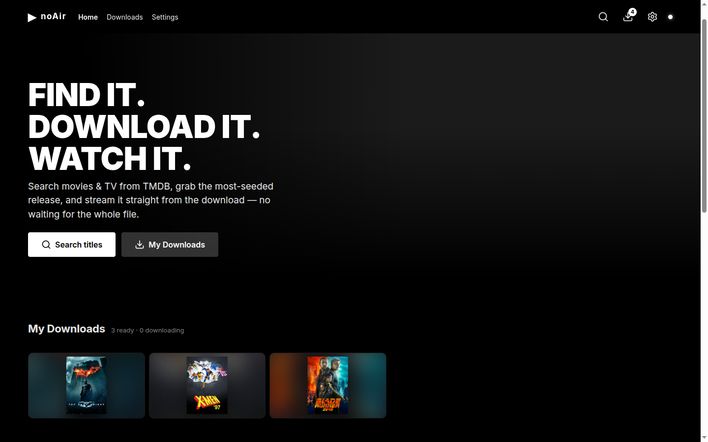
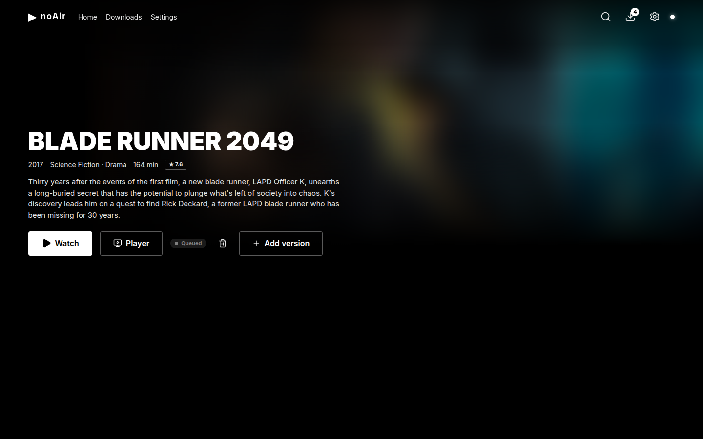
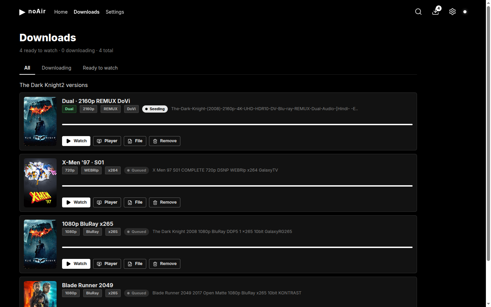
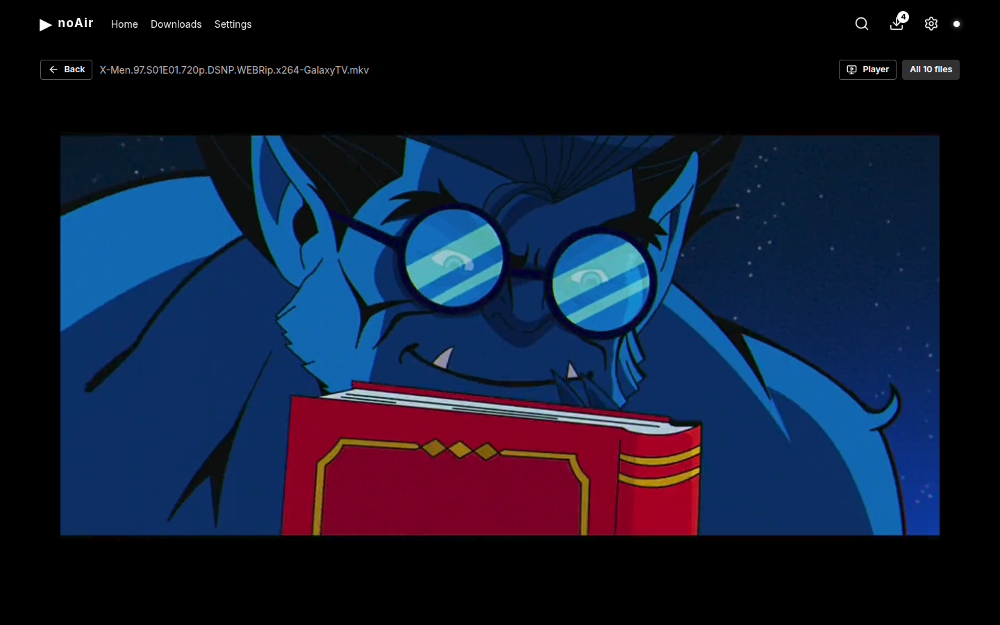

<div align="center">

# noAir

**Self-hosted movie & TV downloader.**

Search the TMDB catalog, find the best release with Prowlarr, download it with qBittorrent,
and stream it straight from your own library — nothing leaves your hardware.

The goal is **~90% of titles stream in-browser with no external player**: keep your machine on,
open a tunnel (or point your own domain at it), and watch from your TV, another PC or your phone —
anywhere. External players (VLC/MPV/…) are a fallback for the long tail (4K/HEVC, exotic codecs),
never the norm.




</div>

## Features

| | |
|---|---|
| **Discover** | Browse and search movies & TV through the TMDB catalog — titles, posters, backdrops, trailers, seasons and episodes. |
| **Find** | Tracker-agnostic torrent search through Prowlarr. Enable any indexer (1337x, The Pirate Bay, YTS, …) — nothing is hard-coded. |
| **Download** | Best-matching, most-seeded release goes to qBittorrent. Sequential download pulls playback-ready pieces first. |
| **Track** | Live progress over Socket.IO — state, speed, ETA, pause, resume, remove. |
| **Watch** | In-browser playback of finished files with automatic codec handling — audio remux, HLS packaging, and an on-demand cached **H.264 compatibility copy** for HEVC/x265 titles the browser can't decode (so ~90% of movies play without a local player). |
| **Watch anywhere** | Keep your machine on and open a **Cloudflare tunnel** (beta) or configure your own domain — then watch from your TV, another PC or your phone. |
| **Open in your player** | 4K/HEVC or exotic audio? One click hands the file to VLC, MPV, MPC-HC or PotPlayer via a one-time `movie://` registration. |
| **Cinematic UI** | A black & white chrome over full-color artwork — hover-trailer previews, IMDb ratings, quality-filtered release lists, and per-title version grouping. |

## Screenshots

| | |
|---|---|
|  |  |
| Title detail — metadata, versions, watch | Downloads — grouped versions & status |
|  |  |
| Watch — in-browser playback | Discover — trending rails |

## Stack

| Layer | Technology |
|---|---|
| Frontend | React + Vite + TypeScript (served through nginx) |
| Backend | Node.js + Express + Socket.IO + TypeScript |
| Database | PostgreSQL 16 |
| Indexer | Prowlarr |
| Downloader | qBittorrent |
| Metadata & art | TMDB (optional OMDb, fanart.tv) |
| Cloudflare bypass (optional) | FlareSolverr |

## Quickstart

Requires **Docker + Docker Compose**.

1. Copy the environment template and fill in your credentials — see `docs/credentials.md`
   for where each one comes from:

   ```
   cp .env.example .env
   ```

2. Start the backing services first:

   ```
   docker compose up -d prowlarr qbittorrent postgres
   ```

3. Configure each service once:

   - **Prowlarr** → open `http://localhost:9696`, add at least one indexer
     (Settings → Indexers → Add Indexer) and copy the API key
     (Settings → General → API Key) into `.env` as `PROWLARR_API_KEY`. The app is
     tracker-agnostic and ships with none — an empty Sources list on the Detail page
     means no indexer is enabled yet (see *Indexers* below).
   - **qBittorrent** → open `http://localhost:8080`, set a strong username/password and
     put them in `.env` as `QBITTORRENT_USER` / `QBITTORRENT_PASS`.
   - **TMDB** → get your free key from the TMDB API settings and put it in `.env` as
     `TMDB_API_KEY`.

4. Build and start everything:

   ```
   docker compose up -d --build
   ```

5. Open [http://localhost:5173](http://localhost:5173).

<details>
<summary><b>Adding indexers to Prowlarr</b></summary>

1. Prowlarr UI → **Settings → Indexers → Add Indexer** → pick public trackers (1337x, TPB, YTS, …).
2. For each: pick a **Base Url**, click **Test**, then **Save**.
3. Many public trackers (notably 1337x) sit behind Cloudflare. If an indexer's Test fails with
   *"blocked by CloudFlare Protection"*, either pick a different indexer or set up FlareSolverr:

   - Start it: `docker compose up -d flaresolverr`
   - Prowlarr UI → **Tools → FlareSolverr → Add** → URL `http://flaresolverr:8191`, give it a
     **Tag** (e.g. `fs`), Save.
   - On the blocked indexer, set the same **Tag** (`fs`), then Test again.

</details>

## Open in your player

Downloads play in the browser as soon as the file is complete. Codecs the browser can't decode
(4K/HEVC, exotic audio) show an **"Open in your player"** button instead — and you can hand any
file to your own player (VLC, MPV, MPC-HC, PotPlayer) from Watch, Downloads or a title's page.

Browsers can't launch desktop apps on their own, so the first time you use this on a computer the
app needs one tiny setup file (Settings → Local player):

- **Don't have a player yet?** Settings → Local player → **Get a player** links the official
  download pages (VLC is the easiest for most people). Nothing there installs anything by itself.
- **Connect your player** — download the setup file and double-click it once:
  - **Windows** — the downloaded `.cmd` auto-locates your player, registers the `movie://` link for
    your user (no admin) and prints what it found.
  - **Linux** — run the downloaded `.sh` once: `bash ~/Downloads/install-movie-player.sh`. It
    auto-detects your player (`vlc`/`mpv`, incl. flatpak) and registers the link.

The **Player** buttons always try to open your player — the setup just makes that work, and the
status shown in Settings is informational only. Re-running the file is harmless (it simply
overwrites the launcher). To remove the link, use the uninstaller in Settings.

## Watch anywhere (beta)

The point of noAir is watching from **any device** — your TV, another PC, or your phone — while
your machine keeps running. In-browser playback is the norm (~90% of titles), so the whole app is
a web app you can reach from anywhere once it's exposed.

**Beta: Cloudflare quick tunnel (no account needed).** A single extra container runs `cloudflared`
and gives you a public `https://*.trycloudflare.com` URL:

1. In `.env`, set `REMOTE_ACCESS=1`.
2. Start it: `docker compose --profile remote up -d cloudflared`.
3. Open **Settings → Remote access** in the app — it shows the live URL (the URL changes each time
   `cloudflared` restarts). Open that URL on your TV or another device.

> **The URL is the password.** There is no login, so anyone with the link can search, download and
> delete. For the beta it's assumed only you use it; don't share the URL. A token gate is planned.

To use a **stable URL on your own domain** instead, run a named Cloudflare tunnel: set
`CLOUDFLARE_TUNNEL_TOKEN` (and `CLOUDFLARE_TUNNEL_HOSTNAME`) in `.env` and it routes to the app the
same way.

## Development

For a fast edit→see-it loop use the **Docker dev stack**. Infra containers run
as-is, but `backend` and `frontend` are replaced by live-reloading dev servers
(`tsx watch` + Vite HMR) with your source bind-mounted. Edits land in the
browser at http://localhost:5173 in seconds — nothing ever needs a rebuild:

```
.\scripts\dev.ps1            # start dev stack (builds cached dev images first time)
```

(Short for `docker compose -f docker-compose.yml -f docker-compose.dev.yml up -d --build`.)

While it runs: edit `backend/src` → `tsx watch` restarts the API on save
(:3000 is also exposed on the host for curl); edit `frontend/src` → HMR updates
the browser immediately.

```
.\scripts\dev.ps1 start      # start again without rebuilding images
.\scripts\dev.ps1 rebuild    # rebuild dev images — do this after adding an npm dependency
.\scripts\dev.ps1 logs       # tail backend + frontend logs
.\scripts\dev.ps1 down       # stop everything
```

Production is untouched — plain `docker compose up -d --build` still builds the
real multi-stage images.

### Running natively (optional)

Both apps can also run on the host against the Docker backing services (the
Vite proxy and backend `.env` loading support this), but it needs extra setup:

```
cd backend && npm install && npm run dev      # API + Socket.IO on :3000
cd frontend && npm install && npm run dev     # Vite on :5173, proxies /api + /socket.io to :3000
```

Caveats: the backend spawns `ffmpeg` from PATH (streaming/transcoding), and the
`.env` service URLs (`DATABASE_URL`, `PROWLARR_URL`, `QBITTORRENT_URL`) must be
pointed at `localhost` for native use — so the Docker dev stack above is the
supported workflow.

Checks in each package: `npm test`, `npm run lint`, `npm run typecheck`.

## Ports & LAN exposure

`frontend` (5173), `qbittorrent` (8080) and `prowlarr` (9696) are published on the host.
`postgres` and `backend` are internal-only. qBittorrent requires its own login; **Prowlarr has no
auth** — keep it on a trusted network. Remote access (beta) is an opt-in `cloudflared` container
(compose profile `remote`) exposing only the `frontend` over HTTPS.

## Troubleshooting

<details>
<summary><b>Common issues</b></summary>

- **Broken poster/backdrop images (HTTP 502)**: the backend proxies images from `image.tmdb.org`,
  and some ISP/DNS servers return a dead BunnyCDN edge for that host. `docker-compose.yml` pins a
  reachable edge via `backend.extra_hosts.image.tmdb.org` — if images break again, resolve the host
  with a public resolver (e.g. `Resolve-DnsName image.tmdb.org -Server 1.1.1.1`) and update the
  pinned IP. Check `docker compose logs backend` for `image proxy fetch failed`.
- **Detail page shows "Prowlarr API key invalid"**: `PROWLARR_API_KEY` in `.env` is wrong or missing.
  Copy it from Prowlarr UI → Settings → General → API Key, then `docker compose up -d`.
- **Detail page shows "Prowlarr unreachable"**: the backend can't reach Prowlarr — check the
  `prowlarr` container is up.
- **No sources in the Detail page**: the API key is valid but no indexer returned results — add or
  enable indexers in Prowlarr (see *Indexers* above) and test them.
- **Backend logs `qBittorrent ... 403`**:
  1. qBittorrent's Web UI host-header validation rejects the internal `qbittorrent` Host — open its
     Web UI → Tools → Options → Web UI → *Host header validation* → **Disabled** (or set
     `WebUI\HostHeaderValidationEnabled=false` in `/config/qBittorrent/qBittorrent.conf`), then
     restart the backend.
  2. Repeated failed logins triggered qBittorrent's **IP ban** — the backend polled with wrong
     credentials and banned its own container IP. Restart the qBittorrent container to clear it,
     then fix the credentials in `.env`.
- **HEVC/x265 or `.avi` won't play in-browser**: noAir builds an on-demand H.264 compatibility copy
  for HEVC/x265 ≤1080p titles (watch again after the "Building a web-compatible copy" bar
  finishes). 4K files can build a 1080p copy if you enable it (Settings → Web playback). The long
  tail (4K/HEVC bit-perfect, exotic codecs) remains available via *Download file* + a native player.

</details>

## Security

- Secrets live only in `.env` (gitignored) — never commit them.
- API keys never reach the browser. TMDB images are proxied through `/api/images/tmdb/*`; key-art
  and posters are cached server-side and served from `/api/images/art/*`.
- See `docs/credentials.md` for where each credential comes from and rotation steps.

## Documentation

- `docs/credentials.md` — credential setup and rotation.
- `AGENTS.md` — repository working rules.

Download content you have the right to. Respect the terms of the services you use.
